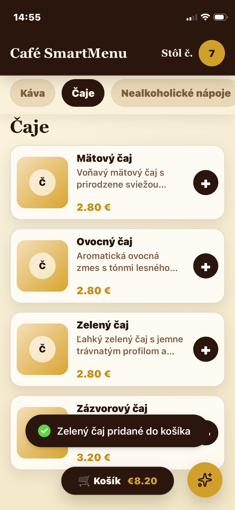
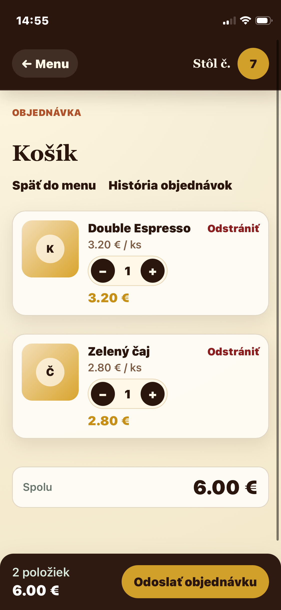
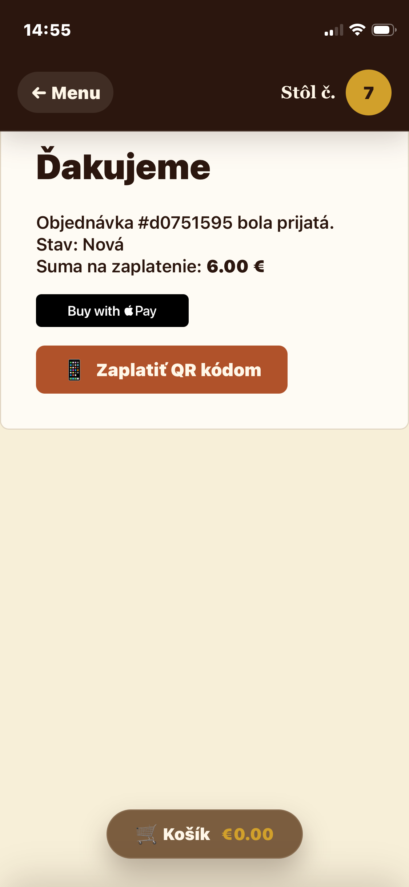
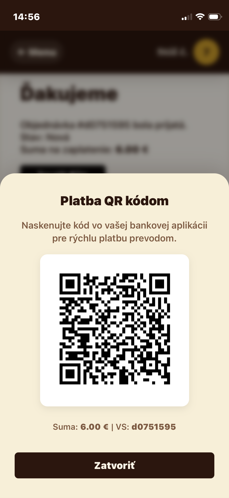
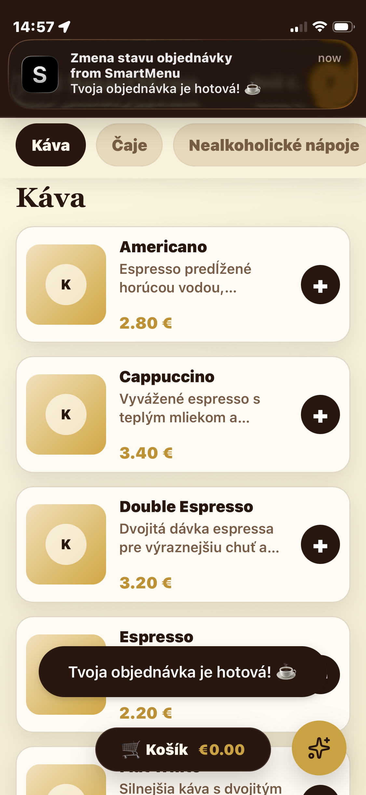
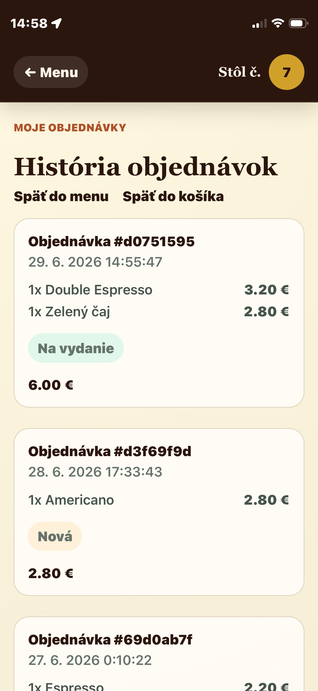

# SmartMenuAI

SmartMenuAI is a full-stack SaaS starter for restaurants and cafes. Customers scan a table QR code, browse the menu, place orders, and receive simple AI-style recommendations based on menu categories and cart contents.

## Demo & Screenshots

### Screenshots
<div style="display: flex; gap: 10px; overflow-x: auto;"></div>

## Features

- **QR Code Payments (EPC Format)**: Instant bank transfers via generated SEPA EPC QR codes, pre-filling payment details (IBAN, variable symbol, and amount) in banking apps.
- **Real-Time Order Tracking**: Toast notifications notify customers of order status updates (Pending, Preparing, Ready, Delivered, Cancelled) using optimized polling.
- **Apple Pay Button Mockup**: Integrated layout support for Apple Pay transactions.
- **Order Management & Flow**: Full cycle of restaurant orders including the new `PAID` status.

## Tech Stack

- **Frontend**: React, Vite, TypeScript, React Router, Axios, `qrcode.react`, `apple-pay-button`
- **Backend**: Node.js, Express.js, TypeScript
- **Database**: PostgreSQL (Prisma ORM)
- **Authentication**: JWT
- **Utilities**: QR code generation (tables & payments), bcrypt password hashing
- **Local infrastructure**: Docker Compose

## Project Structure

```text
SmartMenuAI/
├── frontend/
├── backend/
├── database/
├── docs/
└── README.md
```

## Prerequisites

- Node.js 20+
- Docker Desktop
- npm

## Quick Start

1. Start PostgreSQL:

```bash
docker compose up -d postgres
```

2. Configure backend environment:

```bash
cp backend/.env.example backend/.env
```

3. Install backend dependencies and prepare the database:

```bash
cd backend
npm install
npm run prisma:generate
npm run prisma:migrate
npm run seed
npm run dev
```

4. In a second terminal, start the frontend:

```bash
cd frontend
npm install
npm run dev
```

5. Open the frontend at `http://localhost:5173`.

## Demo Accounts

- Admin: `admin@smartmenu.ai` / `Password123!`
- Customer: `guest@smartmenu.ai` / `Password123!`

## API Base URL

The frontend reads `VITE_API_URL` from `frontend/.env.example`. By default it uses `http://localhost:4000/api`.

## Docker

To run PostgreSQL and the backend together:

```bash
docker compose up --build
```

Run migrations and seed data after the database is ready:

```bash
cd backend
npm run prisma:migrate
npm run seed
```
